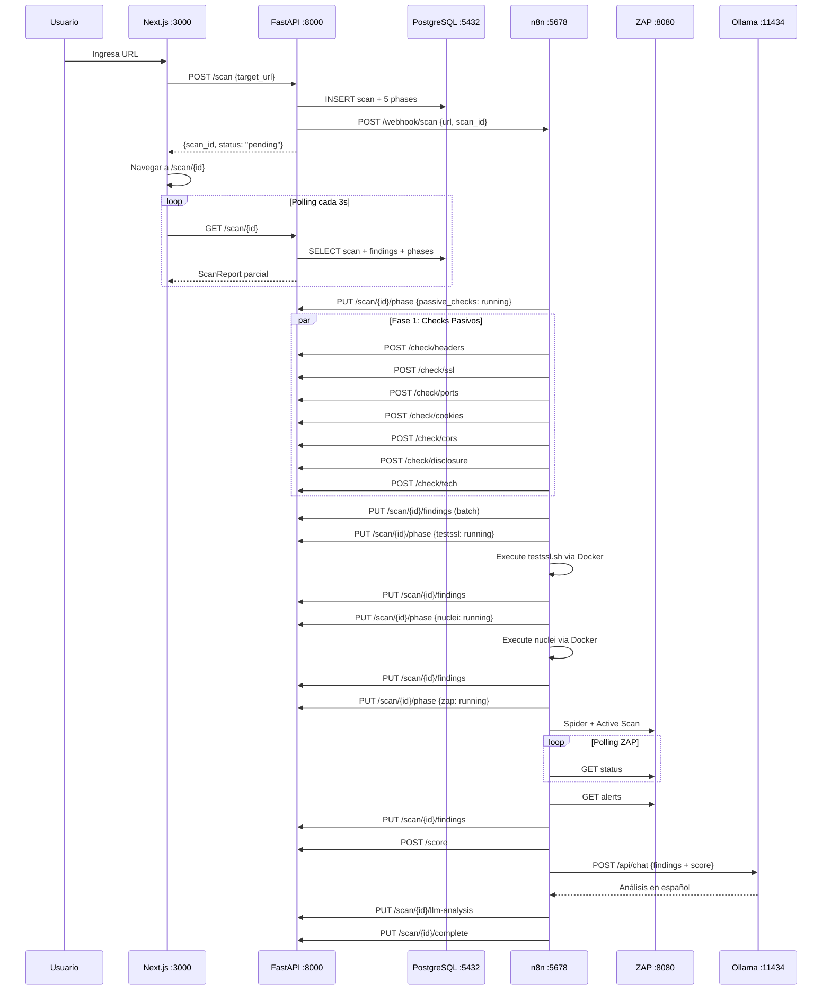

# Entregable 4: Arquitectura Técnica

## 4.1 Diagrama de Arquitectura General

```
┌─────────────────────────────────────────────────────────────────────────┐
│                     Docker Compose (localhost)                           │
│                     Red: scanner-net (bridge)                            │
│                                                                          │
│  ┌──────────────┐  POST /scan   ┌──────────────┐                        │
│  │   Next.js    │──────────────►│   FastAPI     │                        │
│  │   Frontend   │◄──────────────│   Backend     │                        │
│  │   :3000      │  JSON response│   :8000       │                        │
│  │              │               │               │                        │
│  │  • ScanForm  │               │  • 7 Checks   │                        │
│  │  • Progress  │               │  • Scorer     │                        │
│  │  • Report    │               │  • CRUD Scans │                        │
│  │  • ScoreGauge│               │  • Webhook    │                        │
│  └──────────────┘               └───────┬───────┘                        │
│                                         │ POST /webhook/scan             │
│                                         ▼                                │
│                                 ┌──────────────┐                         │
│                                 │     n8n       │                         │
│                                 │   :5678       │                         │
│                                 │               │                         │
│                                 │  Orquestador  │                         │
│                                 │  5 Fases      │                         │
│                                 └──┬───┬───┬──┬┘                         │
│                              ┌─────┘   │   │  └──────┐                   │
│                              ▼         ▼   ▼         ▼                   │
│                   ┌───────────────────────────────────────────┐           │
│                   │        4 FUENTES DE DETECCIÓN              │           │
│                   │                                            │           │
│                   │  ┌────────────┐     ┌────────────┐        │           │
│                   │  │  FastAPI    │     │ testssl.sh │        │           │
│                   │  │  7 Checks   │     │ SSL/TLS    │        │           │
│                   │  │  propios    │     │ Profundo   │        │           │
│                   │  │  (HTTP)     │     │ (CLI)      │        │           │
│                   │  └────────────┘     └────────────┘        │           │
│                   │  ┌────────────┐     ┌────────────┐        │           │
│                   │  │  Nuclei     │     │ OWASP ZAP  │        │           │
│                   │  │  9000+ CVE  │     │ Spider +   │        │           │
│                   │  │  (CLI)      │     │ Active     │        │           │
│                   │  │             │     │ Scan :8080 │        │           │
│                   │  └────────────┘     └────────────┘        │           │
│                   └───────────────────────────────────────────┘           │
│                              │                                            │
│                              ▼ Merge findings                             │
│              ┌──────────┐  ┌──────────┐  ┌──────────────┐                │
│              │ Scoring   │  │  Ollama  │  │ PostgreSQL   │                │
│              │ CVSS      │─►│  LLM     │─►│   :5432      │                │
│              │ Ponderado │  │ llama3.2 │  │              │                │
│              │           │  │  :11434  │  │  4 tablas    │                │
│              └──────────┘  └──────────┘  │  4 vistas    │                │
│                                          └──────┬───────┘                │
│                                                 │                        │
│              ┌──────────┐                       │                        │
│              │ Grafana   │◄─────────────────────┘                        │
│              │ Dashboard │  SQL directo                                   │
│              │  :3001    │                                                │
│              └──────────┘                                                │
│                                                                          │
│              ┌──────────┐                                                │
│              │  DVWA     │  Target de prueba                             │
│              │  :8081    │  (app deliberadamente vulnerable)             │
│              └──────────┘                                                │
└─────────────────────────────────────────────────────────────────────────┘
```

## 4.2 Servicios Docker — Detalle Técnico

| # | Servicio | Imagen Docker | Puerto | Rol | Volumen | Healthcheck |
|---|---|---|---|---|---|---|
| 1 | **frontend** | Build local `node:20-alpine` | 3000 | UI: formulario URL + reportes + progreso | — | — |
| 2 | **backend** | Build local `python:3.12-slim` | 8000 | API REST + 7 checks + scoring + CRUD | — | — |
| 3 | **n8n** | `docker.n8n.io/n8nio/n8n:latest` | 5678 | Orquestador del pipeline | `n8n_data` | — |
| 4 | **postgres** | `postgres:16-alpine` | 5432 | Base de datos relacional | `postgres_data` | `pg_isready` |
| 5 | **zap** | `ghcr.io/zaproxy/zaproxy:stable` | 8080 | Scanner DAST en modo daemon | `zap_data` | — |
| 6 | **ollama** | `ollama/ollama:latest` | 11434 | LLM local (GPU opcional) | `ollama_data` | — |
| 7 | **grafana** | `grafana/grafana-oss:latest` | 3001 | Dashboards de seguridad | `grafana_data` | — |
| 8 | **dvwa** | `vulnerables/web-dvwa` | 8081 | App vulnerable para testing | — | — |
| 9 | **nuclei** | `projectdiscovery/nuclei:latest` | — | Scanner CVE (on-demand CLI) | `scanner-shared` | — |
| 10 | **testssl** | `drwetter/testssl.sh:latest` | — | Auditoría SSL (on-demand CLI) | `scanner-shared` | — |

### Notas de configuración

- **Red compartida**: Todos los servicios están en la red `scanner-net` (bridge), permitiendo comunicación por nombre de servicio
- **Volumen compartido**: `scanner-shared` se monta en n8n, nuclei y testssl para intercambio de archivos de resultados
- **n8n**: Tiene acceso al Docker socket (`/var/run/docker.sock`) para ejecutar comandos en contenedores Nuclei y testssl
- **Ollama**: Configurado con GPU passthrough NVIDIA (opcional, funciona en CPU si no hay GPU)
- **ZAP**: Ejecuta en modo daemon con API key deshabilitada (`api.disablekey=true`)

## 4.3 Modelo de Datos — PostgreSQL

### Diagrama Entidad-Relación

```
┌──────────────────────┐
│        scans          │
├──────────────────────┤
│ id (UUID) PK          │
│ target_url (VARCHAR)  │
│ status (VARCHAR)      │       ┌──────────────────────┐
│ global_score (NUM)    │       │     scan_phases       │
│ total_findings (INT)  │       ├──────────────────────┤
│ created_at (TIMESTZ)  │◄──┐  │ id (UUID) PK          │
│ completed_at (TIMESTZ)│   ├──│ scan_id (UUID) FK     │
│ error_message (TEXT)  │   │  │ phase_name (VARCHAR)  │
└──────────────────────┘   │  │ status (VARCHAR)      │
          │                 │  │ started_at (TIMESTZ)  │
          │                 │  │ completed_at (TIMESTZ)│
          │                 │  │ findings_count (INT)  │
          │                 │  │ error_message (TEXT)  │
          │                 │  └──────────────────────┘
          │                 │
          │  1:N            │  1:N
          ▼                 │
┌──────────────────────┐   │  ┌──────────────────────┐
│      findings         │   │  │    llm_analyses       │
├──────────────────────┤   │  ├──────────────────────┤
│ id (UUID) PK          │   │  │ id (UUID) PK          │
│ scan_id (UUID) FK ────┼───┘  │ scan_id (UUID) FK ────┤
│ source (VARCHAR)      │      │ raw_prompt (TEXT)     │
│ category (VARCHAR)    │      │ raw_response (TEXT)   │
│ title (VARCHAR)       │      │ recommendations (JSONB│
│ severity (VARCHAR)    │      │ model_used (VARCHAR)  │
│ cvss_score (NUM)      │      │ duration_ms (INT)    │
│ description (TEXT)    │      │ created_at (TIMESTZ)  │
│ remediation (TEXT)    │      └──────────────────────┘
│ raw_data (JSONB)      │
│ created_at (TIMESTZ)  │
└──────────────────────┘
```

### Relaciones

| Tabla padre | Tabla hija | Cardinalidad | ON DELETE |
|---|---|---|---|
| `scans` | `scan_phases` | 1:N (1 scan → 5 fases) | CASCADE |
| `scans` | `findings` | 1:N (1 scan → N findings) | CASCADE |
| `scans` | `llm_analyses` | 1:N (1 scan → 1+ análisis) | CASCADE |

### Índices

| Tabla | Columna(s) | Tipo | Propósito |
|---|---|---|---|
| `scans` | `status` | B-tree | Filtrar scans por estado |
| `scans` | `created_at DESC` | B-tree | Listar scans recientes |
| `scan_phases` | `scan_id` | B-tree | JOIN con scans |
| `findings` | `scan_id` | B-tree | JOIN con scans |
| `findings` | `severity` | B-tree | Filtrar por severidad |
| `findings` | `source` | B-tree | Filtrar por fuente |
| `llm_analyses` | `scan_id` | B-tree | JOIN con scans |

### Vistas de Grafana

| Vista | Propósito |
|---|---|
| `v_findings_by_severity` | Findings agrupados por scan + severidad (para pie chart) |
| `v_findings_by_source` | Findings agrupados por scan + fuente (para bar chart) |
| `v_recent_scans` | Últimos 50 scans con duración calculada |
| `v_top_categories` | Top 20 categorías de vulnerabilidad más frecuentes |

## 4.4 APIs del Sistema

### FastAPI Backend (puerto 8000)

| Endpoint | Método | Descripción | Consumido por |
|---|---|---|---|
| `GET /health` | GET | Health check + estado BD | Monitoring |
| `POST /scan` | POST | Crear scan + disparar n8n | Frontend |
| `GET /scan/{id}` | GET | Reporte completo del scan | Frontend (polling) |
| `GET /scans` | GET | Últimos 20 scans | Frontend (home) |
| `PUT /scan/{id}/phase` | PUT | Actualizar estado de fase | n8n |
| `PUT /scan/{id}/findings` | PUT | Insertar findings | n8n |
| `POST /score` | POST | Calcular score global | n8n |
| `PUT /scan/{id}/llm-analysis` | PUT | Guardar análisis LLM | n8n |
| `PUT /scan/{id}/complete` | PUT | Marcar scan completado | n8n |
| `POST /check/headers` | POST | Check 12 headers seguridad | n8n |
| `POST /check/ssl` | POST | Check SSL/TLS | n8n |
| `POST /check/ports` | POST | Escaneo 21 puertos | n8n |
| `POST /check/cookies` | POST | Check flags de cookies | n8n |
| `POST /check/cors` | POST | Check misconfiguration CORS | n8n |
| `POST /check/disclosure` | POST | Check info disclosure | n8n |
| `POST /check/tech` | POST | Detectar tecnologías | n8n |

### OWASP ZAP API (puerto 8080)

| Endpoint | Método | Descripción |
|---|---|---|
| `GET /JSON/spider/action/scan/` | GET | Iniciar spider |
| `GET /JSON/spider/view/status/` | GET | Polling estado spider |
| `GET /JSON/ascan/action/scan/` | GET | Iniciar active scan |
| `GET /JSON/ascan/view/status/` | GET | Polling estado active scan |
| `GET /JSON/alert/view/alerts/` | GET | Obtener alertas/findings |
| `GET /JSON/core/view/version/` | GET | Verificar conectividad |

### Ollama API (puerto 11434)

| Endpoint | Método | Descripción |
|---|---|---|
| `POST /api/chat` | POST | Analizar findings con LLM |
| `GET /api/tags` | GET | Verificar modelos descargados |

## 4.5 Comunicación entre Servicios



## 4.6 Tecnologías y Versiones

| Tecnología | Versión | Propósito |
|---|---|---|
| Docker Compose | v2+ | Orquestación de contenedores |
| Python | 3.12 | Backend FastAPI |
| FastAPI | 0.115.x | Framework API REST async |
| SQLAlchemy | 2.0.x | ORM async para PostgreSQL |
| asyncpg | 0.30.x | Driver PostgreSQL async |
| httpx | 0.28.x | Cliente HTTP async |
| Pydantic | 2.x | Validación de datos |
| Node.js | 20 (Alpine) | Runtime Next.js |
| Next.js | 15.x | Framework React (App Router) |
| Tailwind CSS | 4.x | Framework CSS utilitario |
| TypeScript | 5.x | Tipado estático frontend |
| PostgreSQL | 16 | Base de datos relacional |
| n8n | latest | Motor de workflows |
| OWASP ZAP | stable | Scanner DAST |
| Nuclei | latest | Scanner CVE |
| testssl.sh | latest | Auditor SSL/TLS |
| Ollama | latest | Runtime LLM local |
| llama3.2 | 3b | Modelo de lenguaje |
| Grafana | OSS latest | Dashboard de métricas |

## 4.7 Variables de Entorno

```env
# ── PostgreSQL ──
POSTGRES_USER=scanner
POSTGRES_PASSWORD=scanner_secret_2026
POSTGRES_DB=vulnscanner

# ── n8n ──
N8N_BASIC_AUTH_USER=admin
N8N_BASIC_AUTH_PASSWORD=admin
N8N_ENCRYPTION_KEY=cambiar-esta-clave-en-produccion
WEBHOOK_URL=http://localhost:5678/

# ── Grafana ──
GF_SECURITY_ADMIN_USER=admin
GF_SECURITY_ADMIN_PASSWORD=admin

# ── Ollama ──
OLLAMA_MODEL=llama3.2:3b

# ── Internos (usados por backend) ──
N8N_WEBHOOK_URL=http://n8n:5678
OLLAMA_URL=http://ollama:11434
ZAP_URL=http://zap:8080
```
